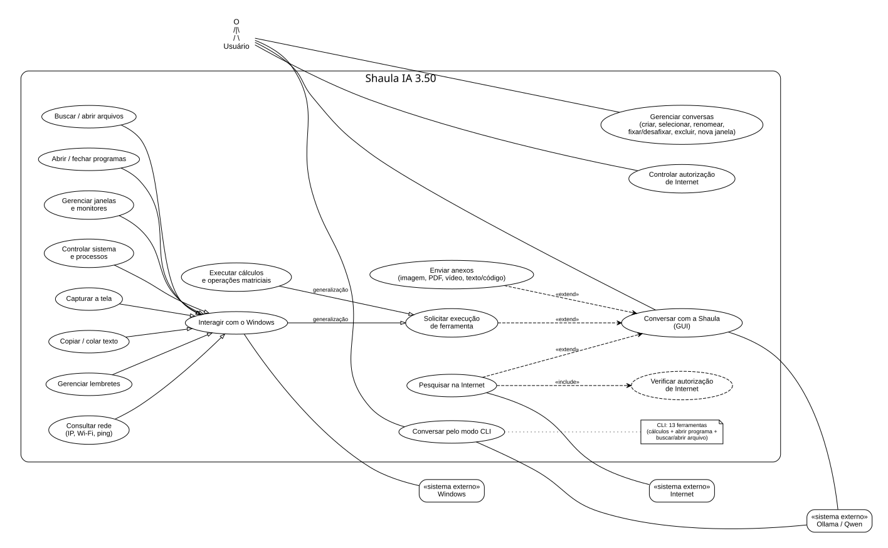

# Diagrama de Casos de Uso — Shaula IA 3.50

Este documento complementa, de forma separada, o README e o UML estrutural da Shaula IA 3.50. O objetivo aqui é representar **o que o usuário consegue fazer com o sistema** e quais sistemas externos participam dessas operações.

O diagrama foi montado com base na versão 3.50 auditada. As 39 ferramentas concretas não são mostradas como 39 elipses individuais, porque isso transformaria o diagrama de casos de uso em um mapa de classes/funções. Elas aparecem agrupadas pelos objetivos percebidos pelo usuário.

## Atores

- **Usuário** — ator principal; conversa com a Shaula, gerencia conversas e solicita ações.
- **Ollama / Qwen** — sistema externo local responsável pelo processamento da linguagem, raciocínio e tool-calling.
- **Internet** — sistema externo consultado pelas pesquisas, com DuckDuckGo e Bing como mecanismos implementados. A Shaula só pesquisa quando sua autorização interna de Internet está ativa.
- **Windows** — sistema operacional externo usado pelas ferramentas de arquivos, programas, janelas, processos, captura de tela, clipboard, rede, lembretes/notificações e ações de sistema.

## Diagrama principal

## Casos de uso principais

| Caso de uso | Escopo na versão 3.50 |
|---|---|
| Conversar com a Shaula | Enviar mensagens pela GUI e receber respostas do modelo local. |
| Conversar pelo modo CLI | Usar `main.py`, com subconjunto de 13 ferramentas. |
| Gerenciar conversas | Criar, selecionar, renomear, fixar/desafixar, excluir e abrir conversa em nova janela. |
| Enviar anexos | Imagens, PDFs, vídeos por amostragem e arquivos de texto/código. |
| Ativar/desativar Internet | Controlar o `EstadoInternet` compartilhado pela aplicação. |
| Pesquisar na Internet | Pesquisa solicitada pelo modelo ou pesquisa automática quando a heurística factual dispara. |
| Executar cálculos | Calculadora, conversão de base e operações matriciais. |
| Buscar/abrir arquivos | Localização de arquivos e abertura pelo Windows. |
| Abrir/fechar programas | Inicialização e encerramento de programas. |
| Gerenciar janelas e monitores | Listagem, movimentação e controle de janelas/monitores. |
| Controlar/consultar sistema e processos | Hardware, processos, bloqueio de tela, desligamento/cancelamento e menu Iniciar. |
| Capturar a tela | Geração de captura de tela pelo subsistema Windows. |
| Copiar/colar texto | Uso da área de transferência do Windows. |
| Gerenciar lembretes | Criar, listar e cancelar lembretes, com notificação local. |
| Consultar rede | IP local, Wi-Fi e teste de ping. |

## Relações importantes

- **Enviar anexos** é uma extensão opcional do caso **Conversar com a Shaula**.
- **Pesquisar na Internet** também pode estender a conversa e inclui a verificação da autorização interna de Internet.
- **Solicitar execução de ferramenta** representa o tool-calling opcional durante uma conversa.
- **Executar cálculos** e **Interagir com o Windows** especializam esse uso de ferramentas.
- Arquivos, programas, janelas/monitores, sistema/processos, captura, clipboard, lembretes e rede especializam **Interagir com o Windows**.
- **Ollama/Qwen** participa das conversas da GUI e do CLI; **Internet** participa das pesquisas externas; **Windows** participa das ações locais dependentes do sistema operacional.

## Correspondência com as 39 ferramentas

Os casos de uso de alto nível acima cobrem as ferramentas concretas da GUI da seguinte forma:

- **Cálculos:** 10 ferramentas.
- **Arquivos/programas:** `abrir_programa`, `fechar_programa`, `buscar_arquivo`, `abrir_arquivo`.
- **Sistema:** `desligar_computador`, `cancelar_desligamento`, `bloquear_tela`, `informacoes_hardware`, `abrir_menu_iniciar`.
- **Internet/rede:** `ativar_internet`, `desativar_internet`, `pesquisar_internet`, `testar_ping`, `obter_ip_local`, `verificar_wifi`.
- **Janelas/monitores:** `listar_monitores`, `listar_janelas_abertas`, `mover_programa_monitor`, `mover_para_outro_monitor`, `controlar_janela`.
- **Captura:** `tirar_print`.
- **Lembretes:** `criar_lembrete`, `listar_lembretes`, `cancelar_lembrete`.
- **Processos:** `listar_processos`, `listar_processos_protegidos`, `finalizar_processo`.
- **Clipboard:** `copiar_texto`, `colar_texto`.

## Arquivos deste diagrama

- `Shaula_Casos_de_Uso_3.50.md` — documentação do diagrama.
- `Shaula_Casos_de_Uso_3.50.puml` — fonte PlantUML editável.
- `Shaula_Casos_de_Uso_3.50.dot` — fonte Graphviz editável.
- `Shaula_Casos_de_Uso_3.50.svg` — versão vetorial renderizada.
- `Shaula_Casos_de_Uso_3.50.png` — versão em imagem.

> Observação: o diagrama representa casos de uso, portanto agrupa detalhes internos. Classes como `RegistroFerramentas`, `GerenciadorAnexos`, `GerenciadorConversas`, estratégias e serviços pertencem ao UML estrutural e não são atores do diagrama de casos de uso.
