# UML da Shaula — versão 3.50

Este documento foi revisado contra o código-fonte presente no pacote **Shaula IA 3.50 docu**.

Ele representa classes e componentes arquiteturais reais da versão auditada. Funções auxiliares internas e `ctypes.Structure` usados apenas como detalhes de implementação não são expandidos em todos os diagramas quando isso não acrescenta clareza arquitetural.

---

## 1. Visão geral da arquitetura

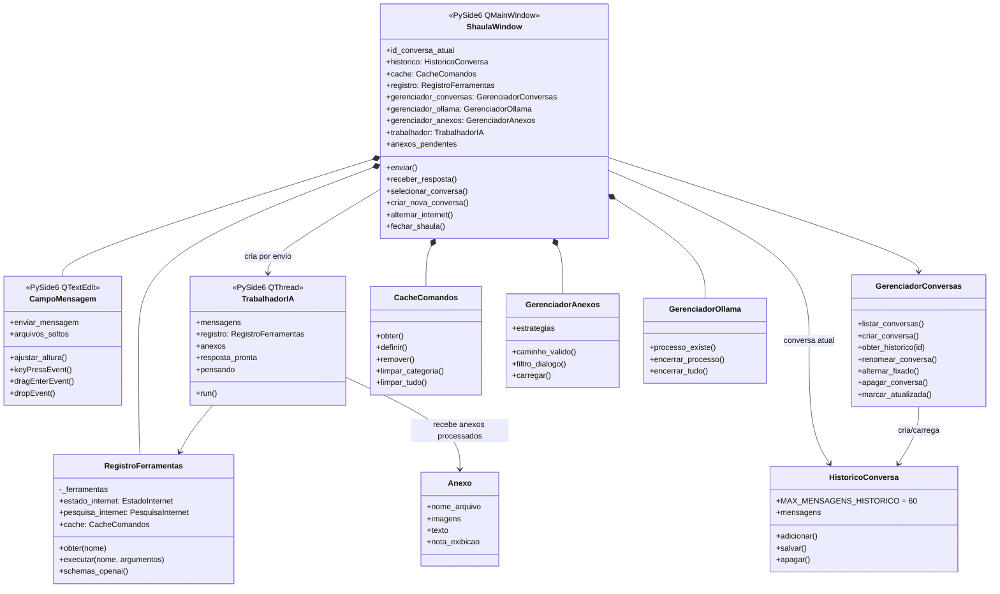

---

## 2. Entrypoints e inicialização

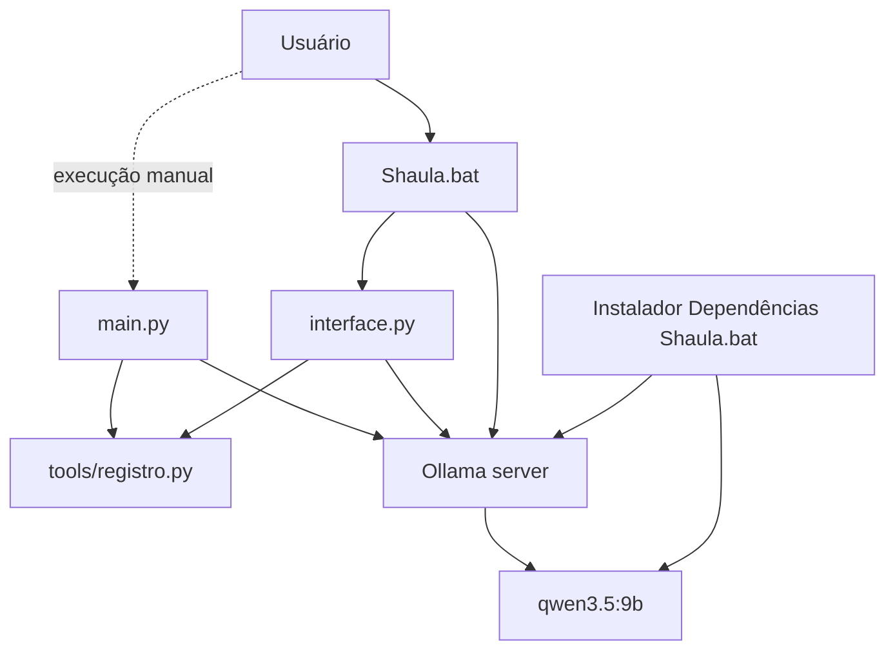

**Importante:** `main.py` não importa nem inicia `interface.py`. Os dois são entrypoints independentes que reutilizam o mesmo subsistema de ferramentas.

---

## 3. Núcleo de ferramentas

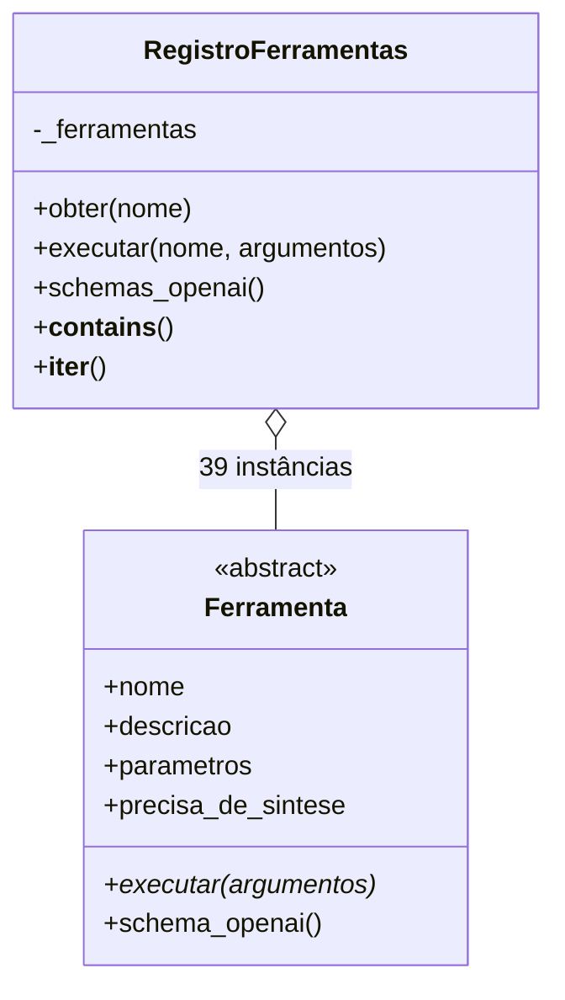

### 3.1 Ferramentas de cálculo — 10

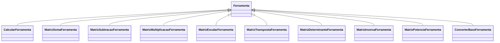

### 3.2 Ferramentas de sistema, arquivos e interação — 29

```mermaid
classDiagram
    Ferramenta <|-- AbrirProgramaFerramenta
    Ferramenta <|-- FecharProgramaFerramenta
    Ferramenta <|-- BuscarArquivoFerramenta
    Ferramenta <|-- AbrirArquivoFerramenta
    Ferramenta <|-- DesligarComputadorFerramenta
    Ferramenta <|-- CancelarDesligamentoFerramenta
    Ferramenta <|-- BloquearTelaFerramenta
    Ferramenta <|-- TestarPingFerramenta
    Ferramenta <|-- InformacoesHardwareFerramenta
    Ferramenta <|-- AbrirMenuIniciarFerramenta
    Ferramenta <|-- AtivarInternetFerramenta
    Ferramenta <|-- DesativarInternetFerramenta
    Ferramenta <|-- PesquisarInternetFerramenta
    Ferramenta <|-- ListarMonitoresFerramenta
    Ferramenta <|-- ListarJanelasAbertasFerramenta
    Ferramenta <|-- MoverProgramaMonitorFerramenta
    Ferramenta <|-- MoverParaOutroMonitorFerramenta
    Ferramenta <|-- TirarPrintFerramenta
    Ferramenta <|-- ControlarJanelaFerramenta
    Ferramenta <|-- CriarLembreteFerramenta
    Ferramenta <|-- ListarLembretesFerramenta
    Ferramenta <|-- CancelarLembreteFerramenta
    Ferramenta <|-- ListarProcessosFerramenta
    Ferramenta <|-- ListarProcessosProtegidosFerramenta
    Ferramenta <|-- FinalizarProcessoFerramenta
    Ferramenta <|-- CopiarTextoFerramenta
    Ferramenta <|-- ColarTextoFerramenta
    Ferramenta <|-- ObterIpLocalFerramenta
    Ferramenta <|-- VerificarWifiFerramenta
```

Não existem no código as classes genéricas `CapturaTelaFerramenta`, `ClipboardFerramenta`, `LembretesFerramenta`, `NotificacoesFerramenta`, `ProcessosFerramenta`, `RedeFerramenta`, `MemoriaFerramenta` ou `ConversasFerramenta` que apareciam no UML anterior.

---

## 4. Serviços e injeção de dependência

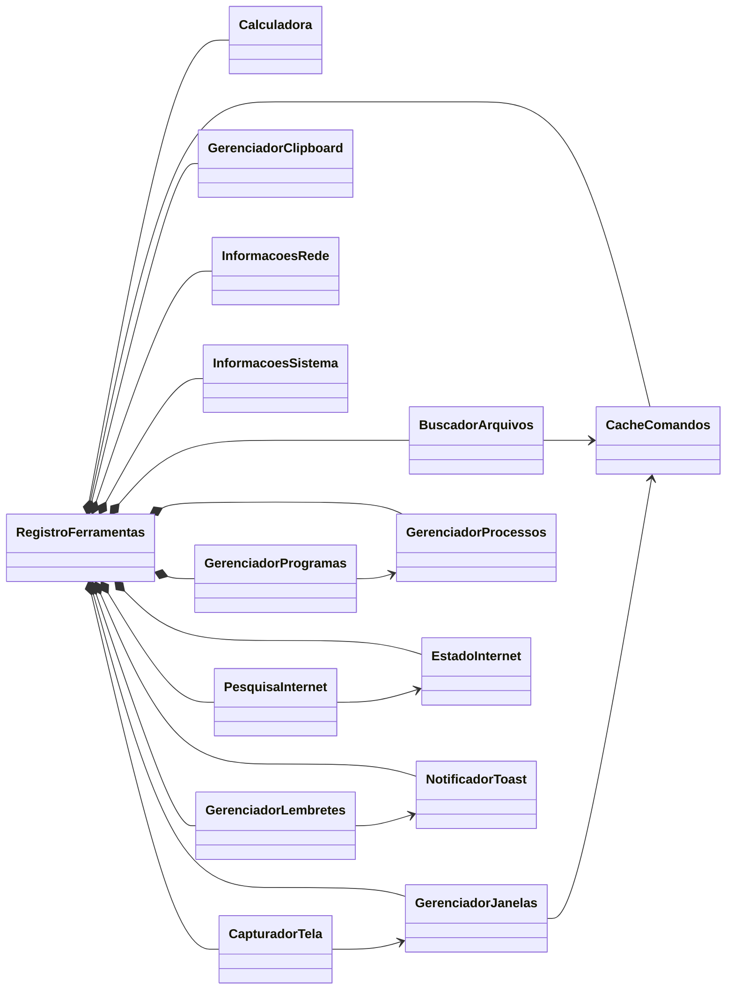

As ferramentas concretas recebem essas instâncias de serviço no construtor; elas não contêm a lógica principal do domínio.

---

## 5. Mapeamento ferramenta → serviço

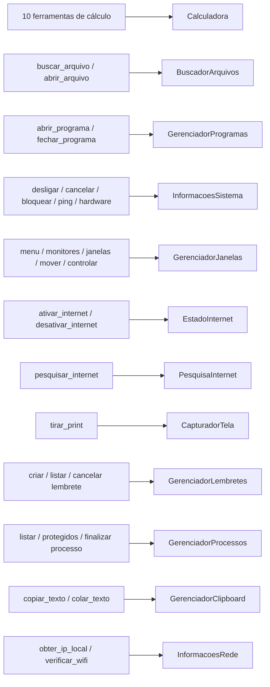

---

## 6. Pesquisa na internet — Strategy

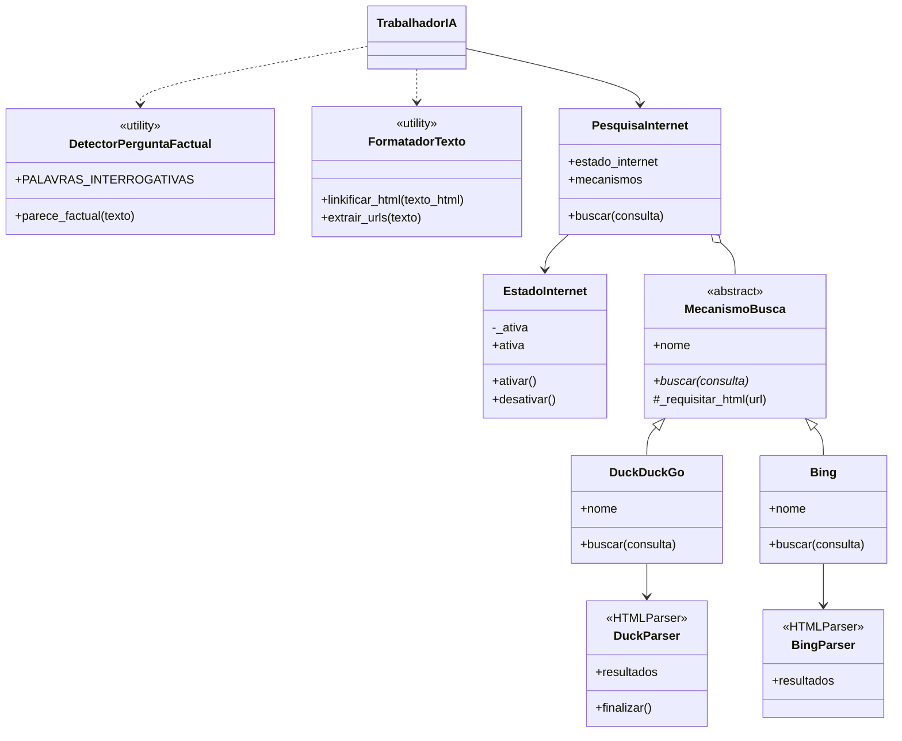

Ordem padrão de fallback: `DuckDuckGo()` e depois `Bing()`.

---

## 7. Anexos — Strategy

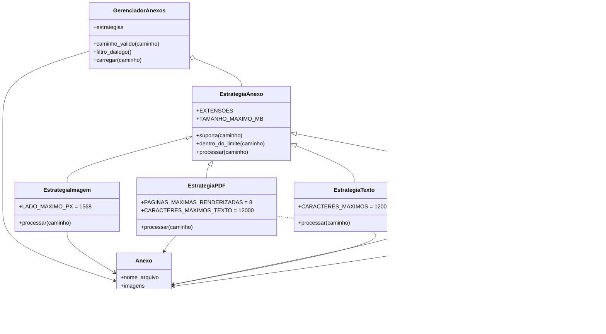

---

## 8. Conversas e persistência

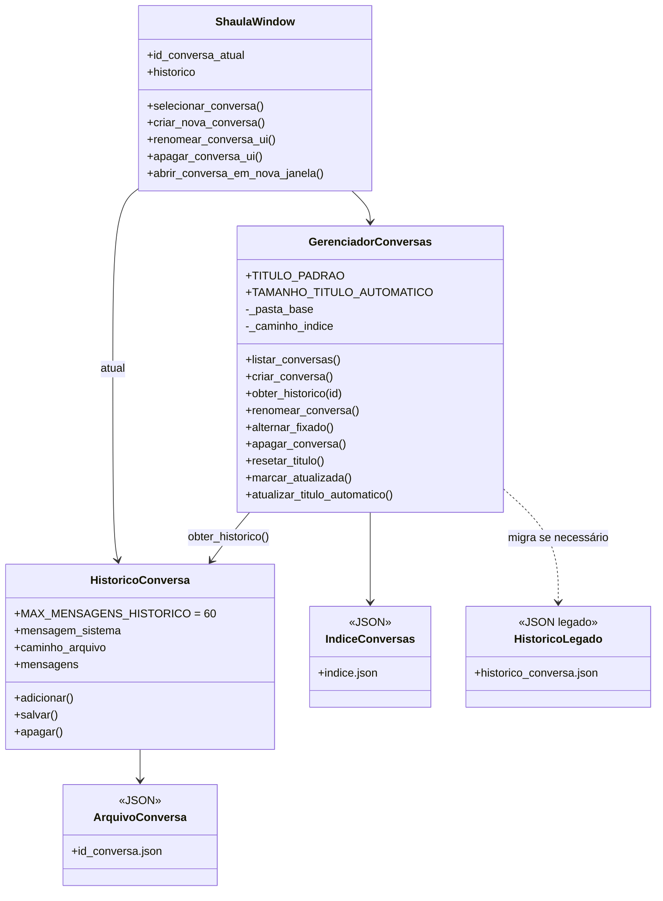

Estrutura padrão:

```text
~/.shaula/conversas/
├── indice.json
└── <id>.json
```

O arquivo legado `~/.shaula/historico_conversa.json` só é usado no processo de migração quando ainda não existe o novo índice.

---

## 9. Sequência de uma mensagem na GUI

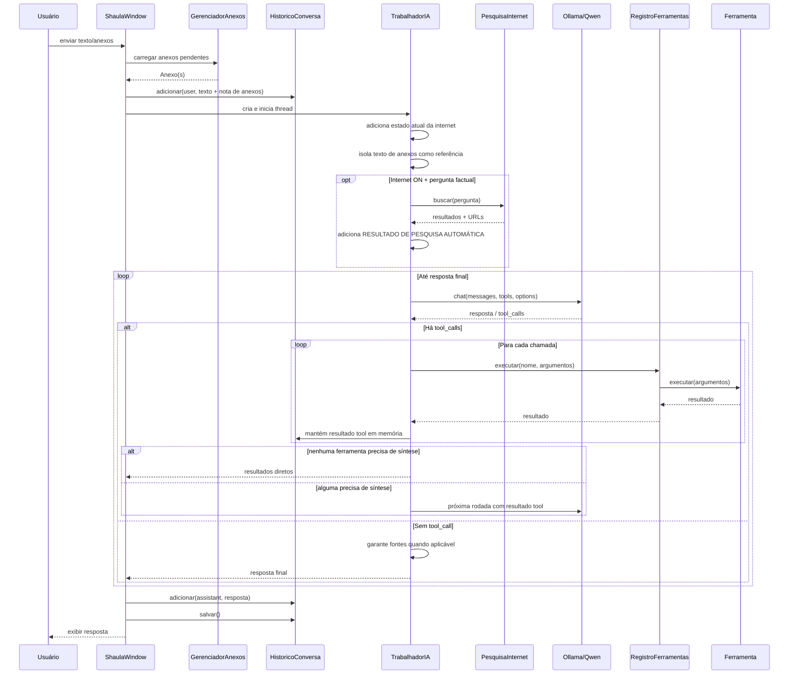

---

## 10. Interface gráfica

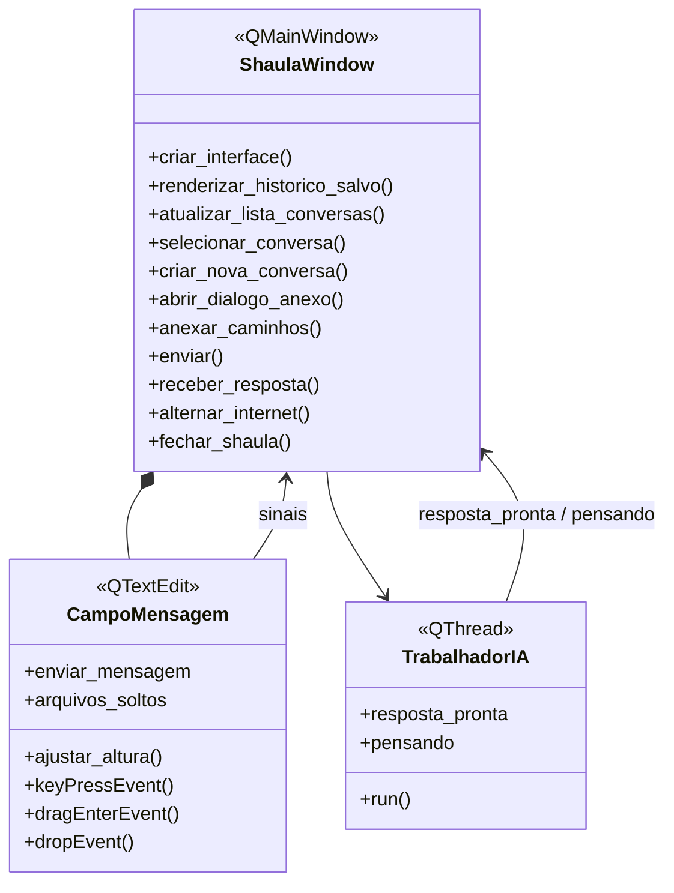

---

## 11. Componentes externos e dependências

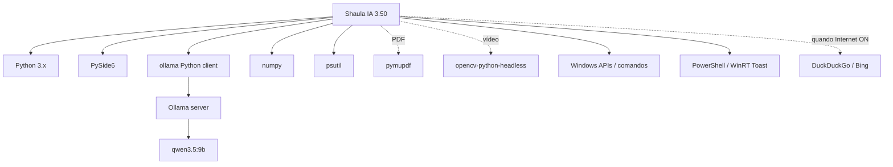

---

## 12. Estrutura de módulos e responsabilidades

```mermaid
flowchart TB
    IF[interface.py<br/>GUI + TrabalhadorIA]
    MAIN[main.py<br/>CLI independente]
    REG[registro.py<br/>composition root]
    BASE[ferramenta.py<br/>classe abstrata]

    CALC[calculadora.py<br/>Calculadora]
    FC[ferramentas_calculo.py<br/>10 ferramentas]
    FS[ferramentas_sistema.py<br/>29 ferramentas]

    CACHE[cache.py<br/>CacheComandos]
    ARQ[arquivos.py<br/>BuscadorArquivos]
    JAN[janelas.py<br/>GerenciadorJanelas]
    PROG[programas.py<br/>GerenciadorProgramas]
    PROC[processos.py<br/>GerenciadorProcessos]
    SIS[sistema.py<br/>InformacoesSistema]
    REDE[rede.py<br/>InformacoesRede]
    CLIP[clipboard.py<br/>GerenciadorClipboard]
    CAP[captura_tela.py<br/>CapturadorTela]
    LEM[lembretes.py<br/>GerenciadorLembretes]
    NOTI[notificacoes.py<br/>NotificadorToast]
    NET[internet.py<br/>EstadoInternet]
    PESQ[pesquisa.py<br/>PesquisaInternet + estratégias]
    MEM[memoria.py<br/>HistoricoConversa]
    CONV[conversas.py<br/>GerenciadorConversas]
    AN[anexos.py<br/>GerenciadorAnexos + estratégias]
    OLP[ollama_processo.py<br/>GerenciadorOllama]

    IF --> REG
    MAIN --> REG
    REG --> BASE
    REG --> CALC
    REG --> CACHE
    REG --> ARQ
    REG --> JAN
    REG --> PROG
    REG --> PROC
    REG --> SIS
    REG --> REDE
    REG --> CLIP
    REG --> CAP
    REG --> LEM
    REG --> NOTI
    REG --> NET
    REG --> PESQ
    REG --> FC
    REG --> FS

    IF --> MEM
    IF --> CONV
    IF --> AN
    IF --> OLP
    CONV --> MEM
    PROG --> PROC
    CAP --> JAN
    LEM --> NOTI
    PESQ --> NET
    ARQ --> CACHE
    JAN --> CACHE
```

---

## 13. Estrutura de arquivos da versão auditada

```text
Shaula IA 3.50 docu/
│
├── interface.py
├── main.py
├── Shaula.bat
├── Instalador Dependências Shaula.bat
├── Instruções Shaula.txt
├── README.md
├── Shaula.ico
├── desktop.ini
│
├── Documentação/
│   └── Shaula_UML_Completo_3.50.md
│
├── tests/
│   └── test_anexos.py
│
└── tools/
    ├── anexos.py
    ├── arquivos.py
    ├── cache.py
    ├── calculadora.py
    ├── captura_tela.py
    ├── clipboard.py
    ├── conftest.py
    ├── conversas.py
    ├── ferramenta.py
    ├── ferramentas_calculo.py
    ├── ferramentas_sistema.py
    ├── internet.py
    ├── janelas.py
    ├── lembretes.py
    ├── memoria.py
    ├── notificacoes.py
    ├── ollama_processo.py
    ├── pesquisa.py
    ├── processos.py
    ├── programas.py
    ├── rede.py
    ├── registro.py
    └── sistema.py
```

> `tools/conftest.py` é a localização observada no pacote. Pelo escopo do fixture, recomenda-se movê-lo para `tests/conftest.py`.

---

## 14. Testes presentes

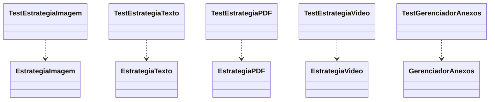

`tests/test_anexos.py` contém 15 testes. A suíte dos demais serviços, mencionada em documentação anterior, não está presente no pacote 3.50 auditado.

---

## 15. Inconsistências do pacote que não são problemas de UML

Durante a conferência foram encontrados pontos que devem ser corrigidos no código/empacotamento, não apenas na documentação:

1. `tools/conftest.py` deveria estar em `tests/conftest.py` para corresponder ao propósito declarado.
2. `main.py` ainda mostra `Shaula v1.80` no banner.
3. `CacheComandos` usa `~/.Shaula`, enquanto os demais componentes usam `~/.shaula`.
4. O instalador não instala `pytest` explicitamente, apesar de o pacote incluir uma suíte pytest.

---

## 16. Resumo arquitetural

A Shaula 3.50 se divide em cinco blocos principais:

1. **Interface e execução da IA** — `ShaulaWindow`, `CampoMensagem`, `TrabalhadorIA`.
2. **Ferramentas e serviços** — `Ferramenta`, `RegistroFerramentas`, 39 ferramentas concretas e classes de serviço injetadas.
3. **Contexto e persistência** — `GerenciadorConversas`, `HistoricoConversa`, `CacheComandos`.
4. **Integrações e estratégias** — pesquisa (`MecanismoBusca`) e anexos (`EstrategiaAnexo`).
5. **Windows/Ollama** — controles locais, notificações, janelas, processos, captura de tela e comunicação com `qwen3.5:9b` via Ollama.

Esse desenho corresponde ao código-fonte auditado da versão 3.50 e substitui as representações legadas que tratavam classes atuais como módulos ou listavam ferramentas que não existem mais com aqueles nomes.
